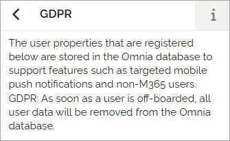

User properties
===================================

The properties you want to use when creating Omnia users must be listed here.

These properties can also be displayed on customized user profile cards, together with properties from Entra ID and SharePoint. They are also used to manage targeted mobile push notifications and user statistics.

**Note**: Be sure to review the GDPR information related to user properties.

Default and Custom Properties
*********************************
A number of default properties are always available. These cannot be edited or deleted.

Additional, expandable properties can be created by an administrator and edited as needed.

You can filter the list by property type. 

GDPR-related information is displayed in this view:

If you need to add new properties, follow the instructions described below (see link).

Read more
**********
For more information, select section below.

.. toctree::
   :titlesonly:

   user-property-add/index
   user-property-display/index
   user-property-edit/index
   user-property-setup/index

