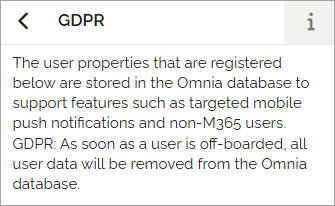
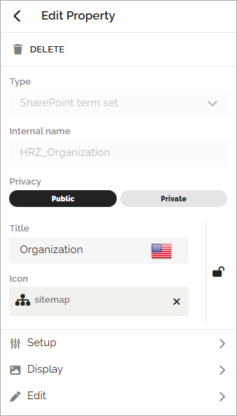

User properties
===================================

The properties you want to use when creating Omnia users must be present in this list. These properties can also be shown on the customized user profile cards together with properties from Entra ID and SharePoint. Besides that, they will also be used to manage targeted mobile push notifications and statistics. Also note the comment about GDPR.

A number of default properties are always available. They can not be edited or deleted. The ones that can be expanded are added by an administrator and can be edited.

You can filter the list on property type. Also note the GDPR information.

If you need additional properties you add them here as described below (see link).

Edit or delete a property
****************************
Available options when editing a property depends on the type of property. Here's an example:

Here you can also choose to delete the property.

Deleting a user property
**************************
When you delete a user property from this list, it's not deleted directly, it's moved to the property recycle bin, available under the tenant settings Properties.

Read more
**********
For more information, select section below.

.. toctree::
   :titlesonly:

   user-property-add/index
   user-property-display/index
   user-property-edit/index
   user-property-setup/index

