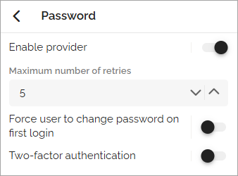
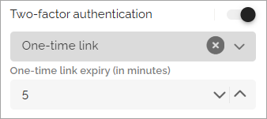

Authentication settings
=====================================

Here you can configure the following authentication-related settings for the selected user type:

+ External providers – If more than one provider is available, make sure to select the correct one.
+ Built-in providers – Choose the authentication method to use for this user type. See below for additional configuration options.
+ Refresh tokens – Applies to mobile apps only. Set the number of days that can pass before a user must log in again.
+ INVALIDATE ALL USER TOKENS – When Omnia permissions have changed, users must log out and log back in for the changes to take effect. Click this button to force all users to log out from Omnia.(See important information below.)

Built-in provider settings
********************************
When expanding one of the Built-in provider options, additional settings become available. For example:

The settings are generally self-explanatory.

If Two-factor authentication is enabled, choose one of the following methods:

+ One-time password
+ One-time link
+ Then, specify the expiration time in minutes.

More on “Invalidate all user tokens”
***************************************
When you click INVALIDATE ALL USER TOKENS, all users are logged out from Omnia. This action only affects Omnia — it does not impact SharePoint, Office apps, email, or any other external services.

If an editor or author is working on a page in Omnia at the time, they will be logged out automatically. However, Omnia auto-saves content frequently, even unpublished content, to minimize the risk of data loss.

