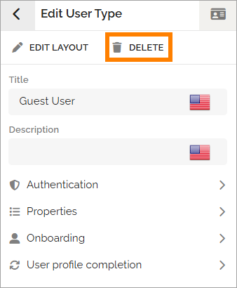
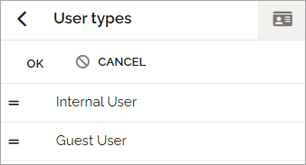

User types
===================================

All users in Omnia will be assigned a user type. User types are also used when creating Omnia users and when setting up dynamic groups. 

Authentication settings and settings for user profile completion are set per user type. Regarding the user card can each user type have different layout, if needed. 

Edit or delete a user type
****************************
Click a user type to edit the settings. All settings available when creating a user type, can be edited, se links below.

You can delete a user type when editing.

You use EDIT LAYOUT to edit the layout for the user card for this user type. See link below for more information.

Create a new  type
***************************
When you create a new user type, add a title and a description, and then the other settings as needed.

Do not forget to click create when all settings are done. Actually, you can also choose to create a new user type with just a title and a description and add the other settings later. See below for links to the settings sections.

Manage the list
*****************
When you select to manage the list, you can use drag and drop to decide the order in which the user types will be shown in lists where user type is selected.

Click OK to save.

Read more
***********
For more information, select section below.

.. toctree::
   :titlesonly:

   authentication-user-type/index
   create-user-type/index
   onboarding-user-type/index
   user-card-layout/index
   user-profile-completion-user-type/index
   properties-user-type/index

