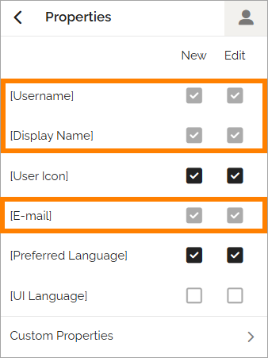
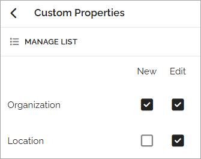
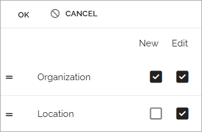

User type properties
=====================================

Here you select which properties should be available for the selected user type.

Some properties are mandatory and cannot be deselected. These are marked in gray:

The remaining properties are either selected (black) or not selected (blank), and you can decide how each selected property will be used:

+ New – Available only when creating a new user of this type.
+ Edit – Available only when editing an existing user.
+ Both – Available both when creating and editing a user.

Custom properties
*******************
Additional properties may appear under **Custom properties**, for example:

These are used in the same way as the standard properties described above.

Manage the property list
**************************
You can also manage the list of properties using drag and drop to define the order in which properties appear when creating a new user.

