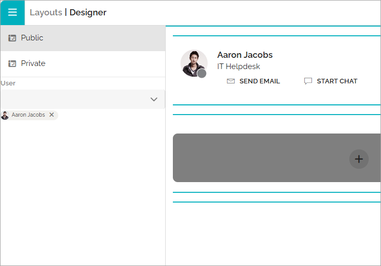
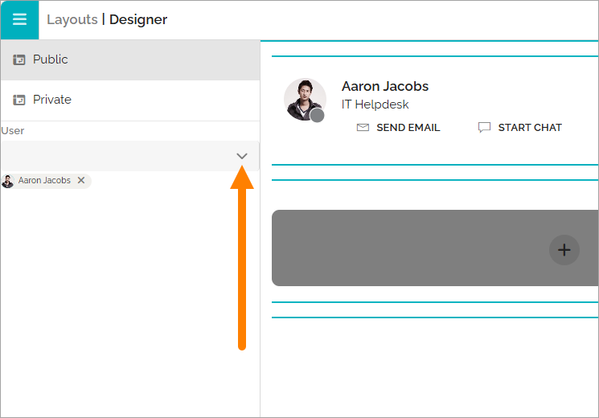

User card layout
=====================================

You can create a custom user profile card for each user type, if needed. It’s also possible to define different layouts for the private card view and the public card view.

The private card view is what a user sees when viewing their own profile card. The public card view is what other users see.

Creating or Editing a User Card Layout
****************************************
To customize the layout, click EDIT LAYOUT when editing or creating a user type.

A basic layout is always available. If you’re satisfied with the default layout, no further changes are required.

You configure the card layout the same way you work with other layouts in Omnia. See: :doc:Working with layouts </v8/common/working-with-layouts/index>

**Note**: Only a subset of the available blocks is typically meaningful to use in a profile card — but the selection is up to you.

Example of a basic user profile card layout (shown in edit mode):

.. image:: user-card-layout-8.png

Public or Private View
**************************
To switch between editing the public and private versions of the card layout, open the menu:

Preview a Profile Card
**************************
While the menu is open, you can also preview the card layout for different users:

**Important note**: When previewing a colleague’s card, your own permissions apply. This means you only see information that you have access to view, not what the other user can see on their profile.

User Edits to the Profile Card
**********************************
Each user can edit their own profile card content.

