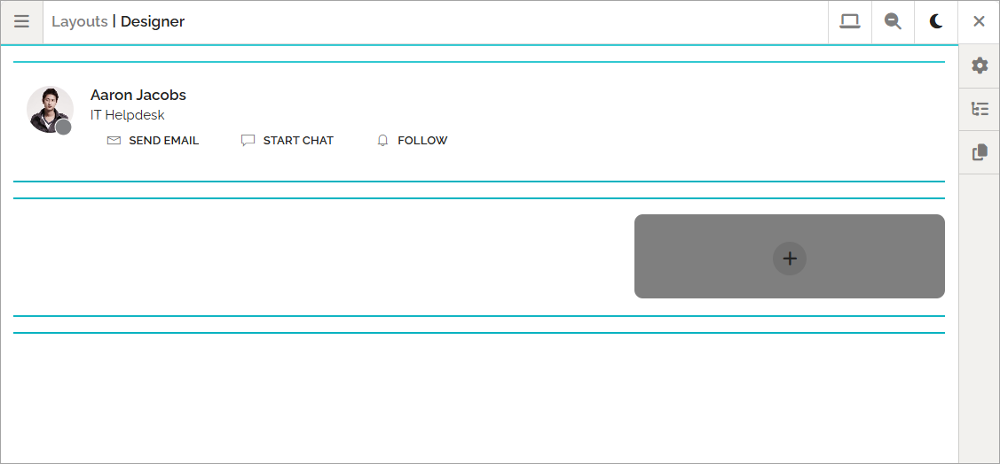

User card layout
=====================================

You can create a custom user profile card for each user user type if needed, and you can create different layouts for private card view and public card view. A private card view is simply when a user looks at his or her own card, a public card view is what everyone else can see. 

This is done by selecting EDIT LAYOUT when editing or creating a user type. A basic layout is always available, so if you're find with that, you don't have to make any changes.

You work with the layout for the cards the same way as other layouts in Omnia, see: :doc:`Working with layouts </general-assets/working-with-layouts/index>`

Of course, just a few of the available blocks makes sense to use here, but that is up to you.

Here's an example of a basic user profile card layout (shown in edit mode):

Public or private
**********************
To choose to work with the public view or the private view of the card layout, open the menu.

Preview a profile card
---------------------------
While the menu is open, you can alos preview the card layout for different users:

.. image:: user-card-layout-user-8.png

**Important note!** When you preview a colleagues card, all permissions are valid, meaning you can just see what YOU have permissions to see, not what the user has permissions for.

User edits of the profile card
************************************
It's up to each user to edit the contents of the profile card. On this page you can see how it works: (Link to be added).

