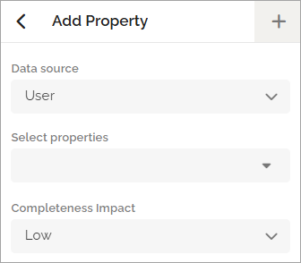
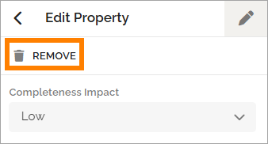
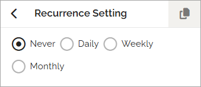

User profile Completion settings
=====================================

All edits are managed on the user profile card. On this tab, you configure the profile completion settings for the selected user type.

The selected properties are listed here. In a new user type, this list will initially be empty.

**Note**: The properties you add for profile completion must also be included in the card layout. Otherwise, the follow-up on profile completion will not be meaningful.

Add a Property
*****************
Click ADD to add a new property. The following options are available:

+ Data source – Select the data source for the property:
o User (Omnia)
o User (Microsoft Graph)
o User (SharePoint)
+ Select properties – Choose the specific property from the selected data source.
+ Completeness impact – Define the property’s impact on profile completeness: Low, Medium, or High.

When calculating completeness, Low = 1 point, Medium = 2 points, and High = 3 points. The total points achieved are divided by the maximum possible points to produce the completion percentage.

Edit or Delete a Property
*****************************
To edit or delete a property, expand the property entry. You can adjust the completeness impact or delete the property if necessary.

Schedule
***********
You can schedule checks for how complete a user’s profile is, based on the settings defined for the user type.

Expand the Schedule section to view and edit the options:

You can set the schedule to:

+ Never (no scheduled checks)
+ Daily
+ Weekly
+ Monthly

For Daily, Weekly, and Monthly, additional configuration options are available.

**Note**: The completeness check is executed when the page containing the User Profile Progress block is updated.

