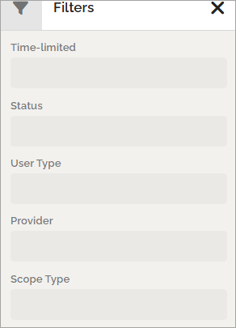

Users - Tenant
===================================

This page describes the Users list in tenant user management. User management for each business profile is also available. Users set up in a business profile can be handled in the business profile by a business profile administrator, or here, by a tenant administrator. User set up here can only be handled by a tenant administrator.

The list of users
*******************
Here, all users in the tenant can be listed. You can add Omnia users - users that do not require a Microsoft 365 license, and edit or delete users you have added this way.

You can use the search field to find a user and use the filters for a shorter list. You can sort the list on the columns "Name", "User type" and "Provider".

When you click on a name, a preview of that users card is shown.

Filters
************
The following filters are available, to display only some users in the list:

+ **Time-limited**: For user accounts with a limited time, you can choose to list active or not active accounts.
+ **Status**: Here you can choose to list enabled or disabled accounts.
+ **User type**: Using this filter you can choose to list just one of the §registrered user types.
+ **Provider**: You can choose to list just one of the providers, usually Microsoft Graph or Omnia.
+ **Scope type**: Here you can choose which users to display in the list; Tenant, Business profile or Group. If you select Business profil or Group, you then select which one as the second step.

**Tip**: If you would like to list Omnia users created here, select "Omnia" for "Provider".

Add a new Omnia user
-----------------------------
To add a new user, click the ADD USER button. For details, see link below. Also note that you can bulk create users.

For more information, select section below:

.. toctree::
   :titlesonly:

   limitations-omnia-users/index   
   tenant-user-bulk-create/index
   tenant-user-create/index
   tenant-user-pending-approval/index
   tenant-user-recycle-bin/index

