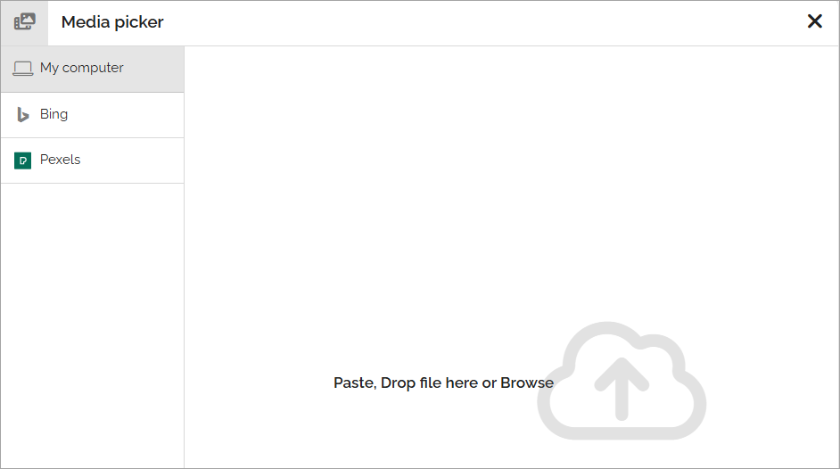

Using the media picker
=============================================

The Media picker, somtimes referred to as the Image picker, can be used to add an image or a video to a block, or to the page content through the RTF editor. Any image on the editor's computer can be selected, as well as from any central image location registered in Omnia admin. An image can be pasted from the clipboard as well. Besides that, additional providers can be set in Omnia admin.

When the Media picker starts, something like the following is shown:

To select an image, after a search in most cases, click it and the settings will be shown. Settings are the same for all images.

A number of providers can be set up. Here are some common ones.

+ Select "My computer" to either paste an image from the clipboard or to browse for an image on your computer.
+ A "Central media bank" can be set up. You can then browse the libraries or search for an image there. Settings for media banks are made for each business profile. Note that videos can be handled in SharePoint media libraries as well, with some Microsoft video editing options.
+ For Bing to be available, the feature "Bing" must be active. When selecting Bing you can search for any image there, or use the predefined search categories, if any is set up. Bing search categories can be set up by an administrator in Omnia admin. **Important note!** Omnia applies a filter to the Bing search automatically so only images that are free to use can be found through the media picker.
+ For Pexels to be available the feature "Pexels" must be active. Available search- or filtering fields depend on what the provider offer. For Pexels only a search field is available. **Important note!** All images from Pexels are always free to use, and edit.

File size larger than recommended
****************************************
If you select an image that is too big, a warning is shown and you can decide what to do. What is considered "too big" in your organization is set up in Omnia admin, together with available options.

**Note!** In the Media block a default scaling can be set. If it is, no dialog for a big image is shown. Instead, all images added will be scaled to the default scaling automatically.

Read more
**************
Select section below for more information.

.. toctree::
   :titlesonly:

   adding-videos/index   
   settings-for-image/index
   using-dall-e-pictures/index   

