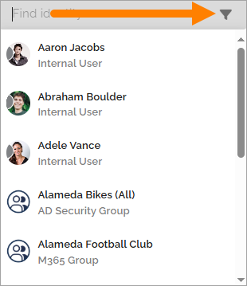
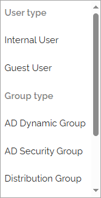

Using the People Picker
=============================================

The People picker — sometimes referred to as the Identity picker — is used in many places throughout Omnia. There are two versions available:

+ The general people picker (described on this page)
+ A version adapted for accessibility features

Prerequisites
******************
To use the People picker, users must be assigned the Directory reader role in the tenant permissions. For more information, see: :doc: Permissions – users and groups </v8/admin/permissions-tenant/users-and-groups/index>

Using the People Picker
**************************
To add users or groups, click in the search field and start typing. Here’s an example:

In most cases, you can add:

+ Individual users
+ Security groups
+ Microsoft 365 groups (Note: In Omnia on-prem environments, Microsoft 365 groups cannot be used.)

Some specific contexts may allow only individual users to be added.

External users invited through Entra ID can also be added. These users can sign in using their own Microsoft 365 accounts.

If you select a user or group by mistake, click the X icon to remove it.

Data Availability
*******************
To ensure users and groups appear in the People picker:

+ They must be imported correctly from Entra ID.
+ If used in a permissions context, they must be permissions-enabled.
+ If used in an email-related context, they must be email-enabled.

Filtering in the People Picker
********************************
If you want to search for a specific user type or group type, you can apply filters by clicking the filter icon:

Available filter options depend on the configuration in Omnia Admin. Here’s an example of possible filters:

