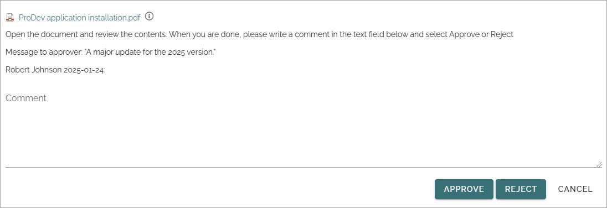

Publish - the approval workflow
================================

When a document has reached a final version, the document must be published, and, if approval is activated, be approved for publication, to be available for readers. To do that, you start an approval workflow.

All metadata must be properly set before the approval workflow is started, so the document for example will be available in the right lists. Some metadata can be mandatory. If all mandatory metadata has not been added, the Approval Workflow can not be started.

**Note!** Metadata can also have impact on who is available as approver.

Any send for comments workflow must be ended before an approval workflow can be started.

In Omnia 7.10 and later, scheduled publishing can be used for controlled documents, if the page type allows it. The document must still be approved before the publishing date. For more information about scheduled publishing, see below.

To publish a document, do the following:

1. Make sure no send for comments workflow is active for the document.
2. Check that all metadata (properties) are correct.
3. Select the document.
4. Open the dot menu and select "Publish".

 
Something like the following is shown (image from Omnia 7.8):

Available options here depends on a number of settings. These are some common options:

+ **Merge with document template**: If the document is not merged with a template, it can be done now. If the document already is merged with a template, this option is not shown. If you select "Yes", open the list and select a template.
+ **Publish new edition/new revision**: When a document has been published at least once, and if the settings allowed it, you can choose to publish a new revision instead (see example below). A revision is a much simpler update, for example to fix some typing errors, and does not require approval. If revisions is not allowed, only "Publish new edition" is shown.
+ **Approver**: You select one approver from the list, or accept the suggested. Available approvers depends on various settings and how the system is set up.
+ **Approval due date**: Here the author adds a date when the approval should be made, at the latest. This is just information for the approvers. The approval workflow is not stopped if this date is passed.
+ **Comments**: Use this field for comments about what was edited/added in a new edition. The field is not shown when the first edition is published.
+ **Read rights**: This sets the read permissions when the document is published. The default selection is to use the default readers group from the site’s permissions. If, for some reason, the read rights for this particular document should be different, you can select "Limit read access", and enter the names of the readers, or any group memberships, for example AD groups.
+ **Convert to PDF**: An administrator can set how this will work, in Omnia admin, and it can be different for each document type – it can be available or not available. Conversion to PDF is only available for docx, pptx and xlsx documents. A preview of the PDF doucment is available through the link "Preview document".
+ **Notify people**: You can use this option (if available) to notify certain people or groups about the new edition of the document. The notification is sent when the document is approved. You can find more information about notifying people on this page: :doc:`Read and understood - notify and read receipt</working-with-documents/authoring-controlled-documents/read-and-understood/index>`. In Omnia 7.7 and later, another way of notifying is to use sign-off requests for documents.
+ **Require read receipt**: When notifying people, you can also select this option for read receipts to be sent to this controlled documents library.
+ **Preview document**: Click here to see a preview of how the approver will see the document, converted to PDF or not.

Here's an example when a document has been published before. "Publish new revision", if allowed, can now be an alternative for simpler updates.

5. Select template if needed, and select all other necessary options.
6. Click SEND.

When you click SEND, a task is created for the approver and an Email is sent, with a link to the document. The task can look like this:

 
The approver automatically has read access to the document (Note! Read access only!), until the task is completed. If a notification panel is set up for tasks, the approver is also notified in the notification panel, and can choose to open the task from there. 

The workflow will be active until the task is completed and the document will be locked for editing during that time.

Semantic search
*******************************
In Omnia 7.8 and later, semantic search can be available. It can be set up in several ways, but a decision about including the document in semantic search, or not, may be needed.

If it's needed, an option is shown:

The option can be pre selected, or not, depending on settings. Either way, the decision can be taken now, in the publishing process.

The semantic search settings can be different for each document type. Also note that the setting for a specific document type can state that all documents of the type should always be included in semantic search. If that is the case, no option is shown when publishing.

For more information, see: :doc:`Document types </admin-settings/tenant-settings/document-management/document-types/index>`

Approved or rejected
*********************
If the document is approved for publication, it’s now available for readers. You, the author, will receive an Email stating that.

If it’s rejected, there’s some changes the approver would like you to do. You will receive an Email stating that the document was rejected and a message from the approver. After changes has been made, you start a new approval workflow the same way as before.

Scheduled publishing for controlled documents
**********************************************
In Omnia 7.10 and later, scheduled publishing can be used for controlled documents. It's set up for each document type, meaning it may not be available for all document types.

If scheduled publishing is allowed, the publishing settings contain this field:

Add the planned publishing date in the field. The document must of course be approved before it can be published, if approval is needed.

Note that the date for scheduled publishing can be set in the properties for the document. If it is, it can  be changed here.

A document waiting to be published is still considered to be a draft. That it's scheduled for publishing is noted in the Status column, for example:

For more info about the publishing, click the link. Here's an example:

Here you can see the scheduled date and time and you can also cancel the schedulation, if needed. This means that the document reverts back to being a normal draft. If the document already has been approved, this is also reverted, meaning the publishing workflow has to be started again. 

For more information about the settings, see the heading "Options for scheduled publishing" on this page: :doc:`Document types </admin-settings/tenant-settings/document-management/document-types/index>`

