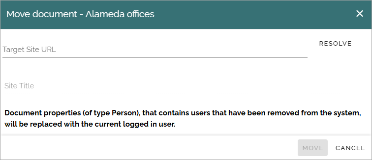

Working with published documents
=================================

The PUBLISHED tab lists the latest editions of all published documents from this controlled documents library. There are some useful options for a published document here. You can for example check the properties, see the document history, see feedback that users has sent and move a document.

A site administrator (owner) can set up which columns to show on this tab. Here's an example:

All options are found in the dot menu for a document. What is available here depends on various settings in Omnia admin, and can also depend on, for example, document type. Here's a common example:

Create draft
**************
You can create a new draft from a published document and start working on the new edition when you need it. The existing edition is still available for users until it's replaced, when the new edition is published.

For more information on how to create a new draft, see the heading "Creating a new draft from a published document" on this page: :doc:`Working with drafts </working-with-documents/authoring-controlled-documents/working-with-drafts/index>`

Signed copy
***************
You can use this option to create a signed copy of a document, that will be available together with the document. The option must be activated for the document type to be available here, see link below.

Use the following steps:

1. Open the dot menu for the document and select "Signed Copy".

2. Download the copy from here:

3. Sign the document the way your organization do; either sign it digitally or print the document and sign it manually, and then scan it.
4. Upload the signed copy.

5. Save when you're done.

If a signed copy is available for a document, it's indicated by this icon:

Users can click the icon to read or download the signed copy.

**Important note!** Signed copy must be added as a column to the document rollup for this icon to be available.

For more information on how to activate the Signed copy functionality, see the heading "Settings for document types" on this page: :doc:`Document types </admin-settings/tenant-settings/document-management/document-types/index>`

Related documents
*******************
You can relate a published document to other published documents. How to do that is described on this page: :doc:`Related documents </working-with-documents/authoring-controlled-documents/related-documents/index>`

Related processes
*******************
Using this option you can see if a document is related to any process(es) - meaning added as a document to the process(es). You can also suggest that the document should be added (related) to a specific process. The suggestion is sent to the feedback receiver for the process.

To check if a dcument is related to any process(es), do the following:

1. Open the dot menu for the document and select "Related processes". 

Any related processes are now listed.

2. To suggest that this document should be related to a process, click ADD SUGEESTION.

3. Scroll the list to find the process, or click in the field and type part of, or the whole, name of the process you have in mind, to search for it.

4. Select the process.

5. Select the process again in the next step, and the click SAVE.

.. image:: related-processes-sent-77.png

And now your suggestion is sent to the feedback receiver for the process, for evaluation.

For information on what the author of the process can do with the suggestion, see this page: :doc:`The Documents tab - authoring processes </working-with-processes-v7/authoring-processes-v7/working-with-drafts-processes/documents-tab-authoring-processes/index>`

Checking a documents properties
*********************************
The properties for a published document can be checked this way:

1.	Click the dot menu for the document.
2.	Select "Properties".
 
The Properties window for the document is shown, for example:

 
The properties can not be edited here. The properties can only be edited when working on a draft for a new edition of the document.

**Note!** A term that has been translated in the term store will be shown in the document's language here, but if the term is shown in the "Published" list, it is shown in the user's language. Also note that placeholders in DOCX and XLSX are replaced with terms based on the document's language.

Copy link
**********
If you need to send a link to a published document, use this option.

Just click the option (no window or message is shown) and you can then paste the link in an Email, in a document, as a link on a page, or wherever you need the link.

.. image:: published-copylink-77.png

**Important note!** This is a link to the actual controlled documents library. Permissions apply, so colleagues need read permissions in the library to be able to read the document.

Document history
******************
There’s quite a lot of information about each published edition available. To see it, do the following:

1.	Click the dot menu for the document.
2.	Select "Document history".
 
Here’s an example:

 
You can, for example, see the publication date for each edition, the author’s comment, if any, and who the document was approved by. Fo further evaluation, or for comparison, a copy of each published edition can be downloaded.

The option "Workflow history" for an edition will show information about when workflows was used and the comments entered during the workflows, so here you can even see information from Send for comments workflows used for the document.

Here's an example from a test environment:

Check feedback
****************
If feedback is set uo, then any user can send feedback on a published document and that feedback is available for authors here. To read feedback for a document:

1.	Click the dot menu for the document.
2.	Select "Feedback".
 
The feedback posts for the document is shown. Click a post to read the feedback. Here's an example:

To find out when the feedback was sent, click the i-icon:

Here's an example of the information available:

You can click the dust bin to delete the feedback when you have read it, or keep it for later reference, it’s up to you.

Read receipt status
********************
This option has to do with the option "Notify people" an author can select when publishing a document. See this page for more information: :doc:`Read and understood - Notify and Read receipt </working-with-documents/authoring-controlled-documents/read-and-understood/index>`

Move a published document
*****************************
A published document can be moved to any other site with a controlled documents library. If a draft for a new edition of the document is present, the draft must first be deleted.

**Note!** You must first check and note (or copy) the URL to the site you want to move the document to.

1.	Open the dot menu for the document.
2.	Select "Move document".

 
The following is shown:

Note the message about what will happen with document properties. 
 
3.	Type the URL (or paste, if you have copied it) to the site in the top field and click RESOLVE. 

**Note!** You should type or paste the URL to the site, note the controlled documents library. If the URL is not correct (for example pointing to the controlled documents library), a message will be displayed saying that the site does not contain a controlled documents library.

If the URL is correct the site title is shown in the second field: Site title. Heres and example:

4.	Click MOVE.

Unpublish and restore a document
**********************************
A published document that has a new draft can't be unpublished, the draft must be deleted first.

The Unliblish option is found in the dot menu for a document:

When you unpublish a document, you must add a message. You can also change your mind at this point:

If you change your mind, just click CANCEL.

I you decide to go on, add a message and then click OK (which becomes available when you add a message).

If an archive for documents is set up, the document is placed in the archive. The unpublished document is also placed in a local (= for the site) recycle bin. 

If needed, an administrator can restore a document from there. When a document is restored, a draft is created in Drafts as a new edition, and can then be edited and published the normal way. Also, if the document was published as a PDF, it's the original document that is restored, so the document can be edited.

The restored document keeps it's ID and the document history is retrieved as well. It's noted in the history that the document has been unpublished and restored (if that happened).  

The recycle bin for controlled documents is found here:

Here, documents can be restored or permanently deleted.

Select the document and select option.

If you choose to permanently delete a document, you get a chance to change your mind:

.. image:: delete-document-613-recycle-bin-options-delete-77.png

If you choose to restore a document, the following is shown:

These are the same options as when you create a draft from a published document. See above for a decription.

Creating sign-off requests for documents
*******************************************
In Omnia 7.7 and later, sign-off requests can be created for controlled documents. To send a request for a single document, use the option on the PUBLISHED tab.

For this to be available, the tenant feature "Sign-off request for controlled documents" must be active and the option "Enable sign-off request" must be selected for the document type.

If the prerequisits are in place, the menu for a published document contains this option:

Select it and the following settings are available:

These settings are the same as when sign-off requests are created using the option at tenant level, see link *Requests* below. When using the tenant option, a sign-off request can be created for a number of published documents, or for a combination of pages and documents (or just for pages).

There's also a Sign-off requests rollup block available to make requests available on pages.

For more information, see: 

+ :doc:`Requests </admin-settings/tenant-settings/sign-off-requests-613/sign-off-request-requests-613/index>`

+ :doc:`Document types </admin-settings/tenant-settings/document-management/document-types/index>`

+ :doc:`Sign-off requests rollup block </blocks/sign-off-requests-rollup-613/index>`

