Using the Create new document wizard
============================================

The Create new document wizard can be used to create either controlled documents or standard documents. A new document created in the wizard can be saved in any libray the logged in user has access to (a controlled documents library for a controlled document or a documents library for a standard document). It can also be possible to save new standard documents to the user's OneDrive.

This wizard is always available in all controlled documents libraries.

To be available in other document libraries, the Create new document wizard must be activated in the features for each teamwork app. 

The wizard can also be made available this way:

+ In the action menu.
+ Through a button in an action button block.

Here's an example for the action menu:

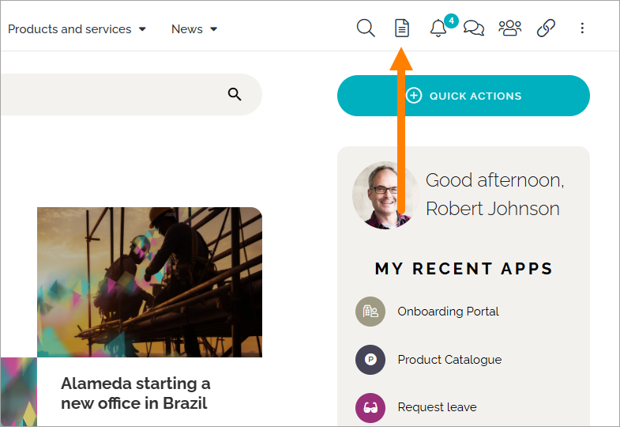

The setting for making the wizard available in the action menu is found in the header settings for the business profile. See the heading "Action menu" on this page for more information about the setting: :doc:`Header settings for the business profile </admin-settings/business-group-settings/settings/header/index>`

An action button block can be placed on any publishing page. For more information, see this page: :doc:`The Action button block </blocks/button-link/index>` 

Creating a new controlled document
************************************
Use the wizard this way to create a new controlled document:

1. See to that "Controlled document" is selected.

2. Select language if needed.

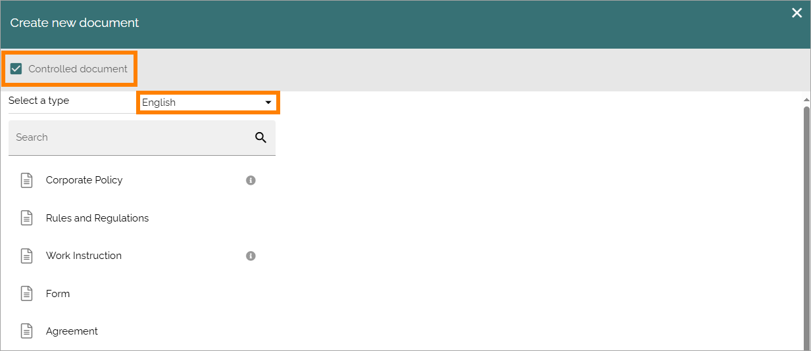

There can be different sets of document types depending on language chosen. If your organization is producing controlled documents in several languages, you may have to select language to see the correct set of document types.

3. Select the document type the template belongs to.

There can also be one or more suggested templates shown. See below for more info.

The document types are set up in Omnia admin. The first list you will see here is normally the most commonly used document types. A document type contains a number of templates. You may have to open a group to find the document type you're after.

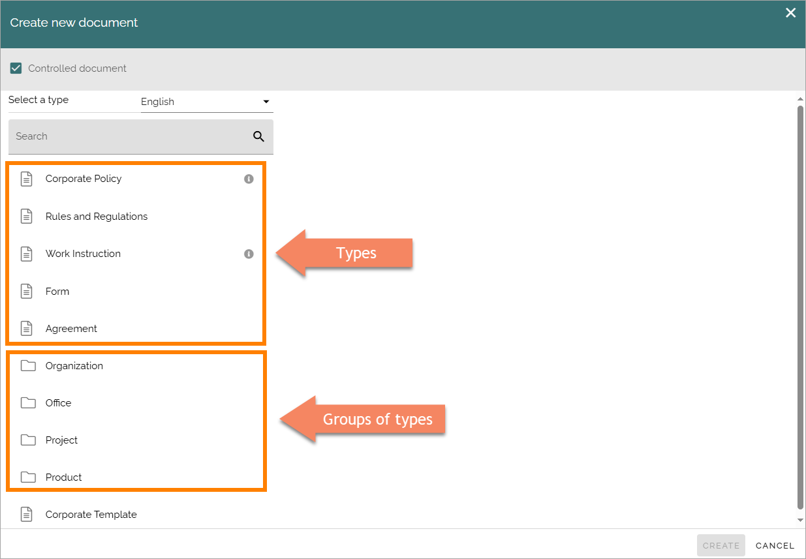

An i-icon is displayed if a description has been added to a document type. Point at the i-icon to read the description.

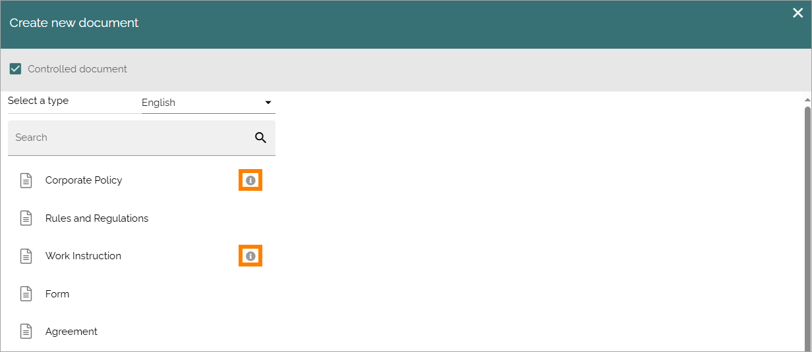

4. Select template. You must click on the template, even if there's only one.
5. Add a title for the new document.
6. Select/add document owner.
7. Set the other settings that may be needed, depending on document type.

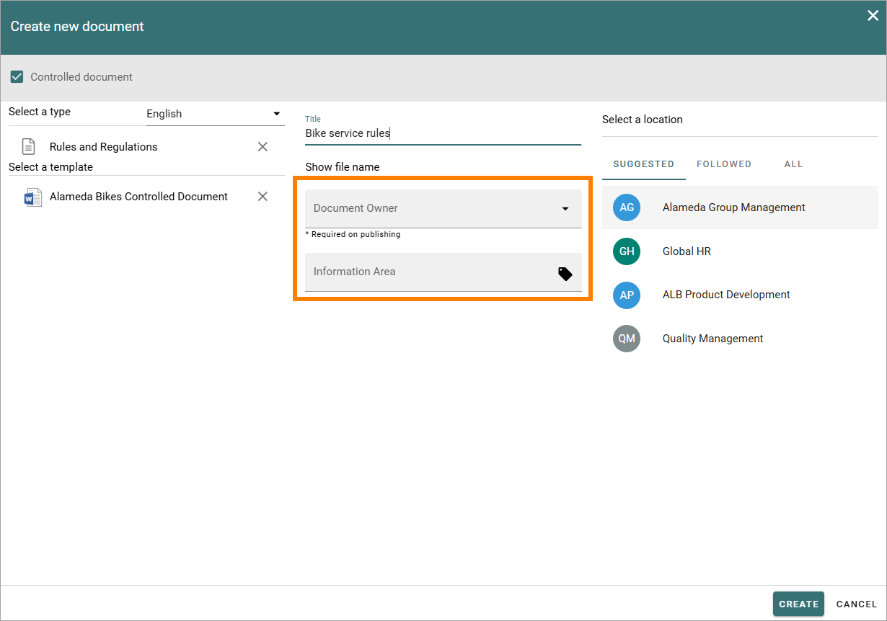

**Note!** A term that has been translated in the term store will be shown in the document's language here. Also note that placeholders in DOCX and XLSX are replaced with terms based on the document's language.

8. Choose where to save the new document. 

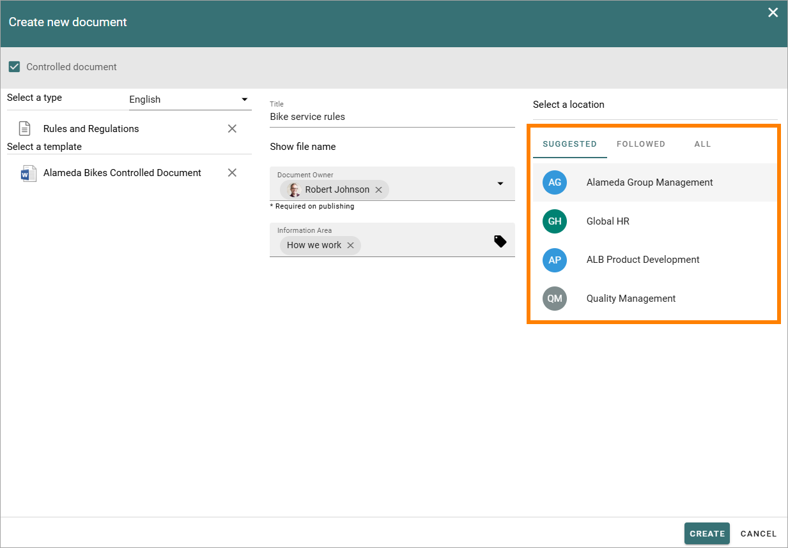

**Note!** In some rare cases available properties depends on where the document will be saved. In these cases, the correct propertes are shown after the place to save the document has been selected.

If you are creating a new document in a controlled documents library, the active site is selected in the SUGGESTED list. If you have started the wizard from the action menu, some common locations can be suggested.

10. To select where to save the document, use the lists SUGGESTES and FOLLOWED to navigate to the site. Use ALL to search for a library,
11. Click CREATE.

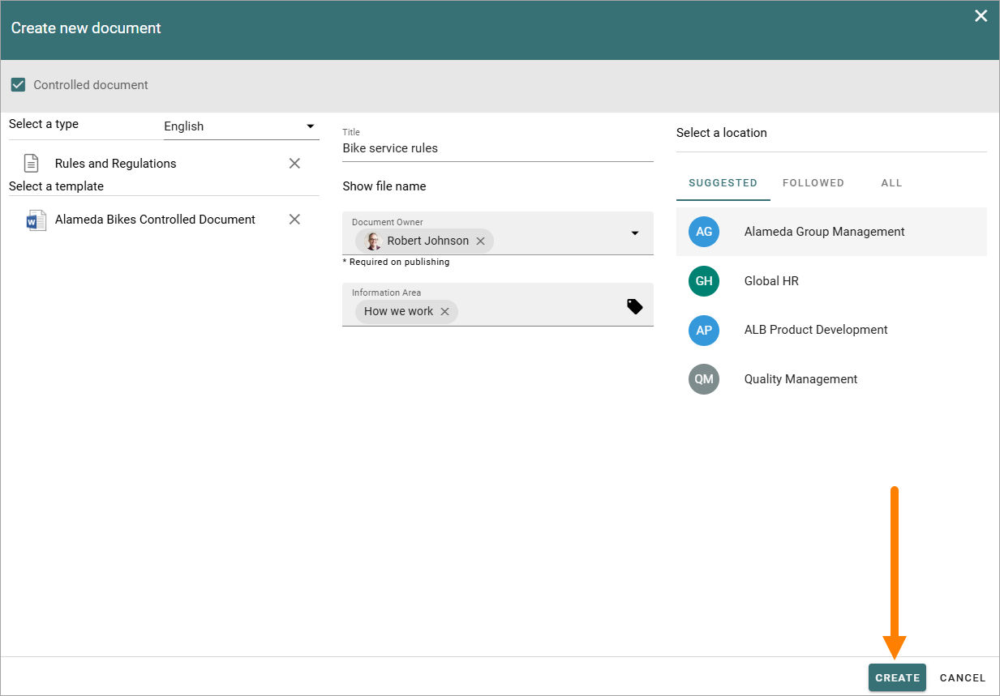

The document is now created in the chosen location and you can work on it the usual way. The location is normally opened automatically so you can start working on the document right away.

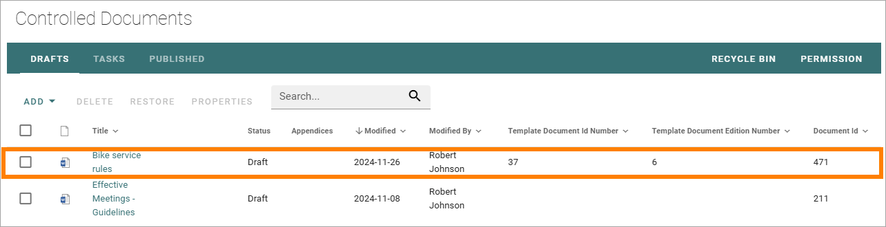

**Note!** If you come across metadata fields (placeholders) visible in the document, displayed within double brackets, they should not be used in the editing process. Information will be added to these fields when the document is published.

**Note!** If a term that has been translated in the term store will be shown in the list, it's shown in the user's language. When properties are displayed for a document, in that window, the term is shown in the document's language.

Suggested templates
---------------------
An administrator of a controlled documents library can set up one or more suggested templates, to stream line the process. It can be useful if there's one or a few templates that is, or should be, used very often.

If suggested templates have been set up, it can look like this:

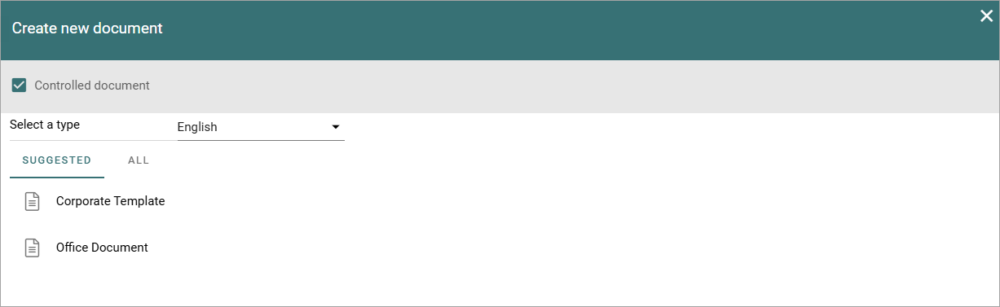

In the example above, two templates are available on the SUGGESTED tab. To use one of them, just click the template and add name, properties and a place to save, as described above.

If you need to use another template, click ALL.

Creating a standard document
******************************
An author of controlled documents can always create standard documents as well in the controlled documents library he or she has access to, if templates for standard documents are set up in Omnia admin. To make it possible for other users to create standard documents using the document wizard, some kind of access to the wizard has to be set up, see above.

To create a new normal document, do the following:

1. Start the document wizard where it is available.
2. Make sure Controlled document is NOT selected (if a user don't have permission to create controlled documents, the option can't be selected).

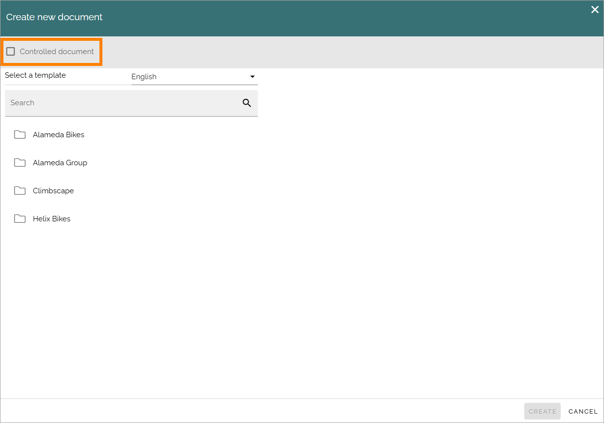

3. Select language for the template if needed.

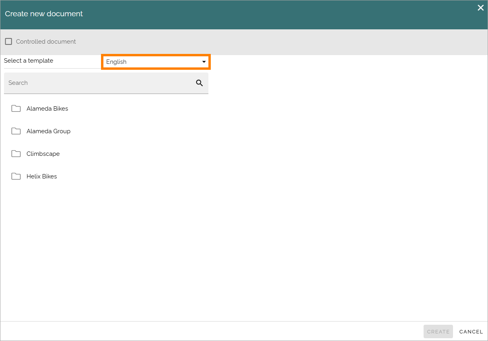

4. Open a template group if necessary, and then select template.

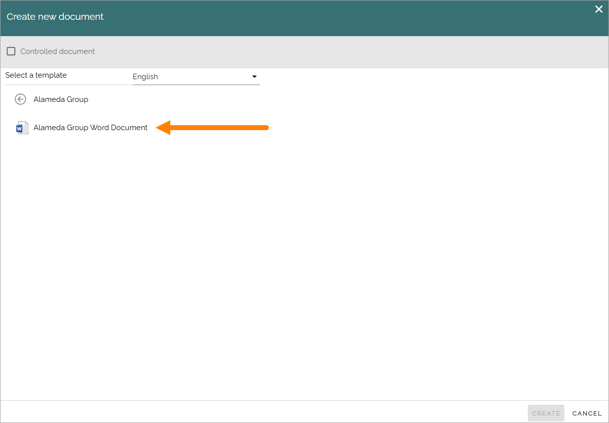

5. Add a title, edit the file name and add other information that may be needed for the template, depending on how it's set up.

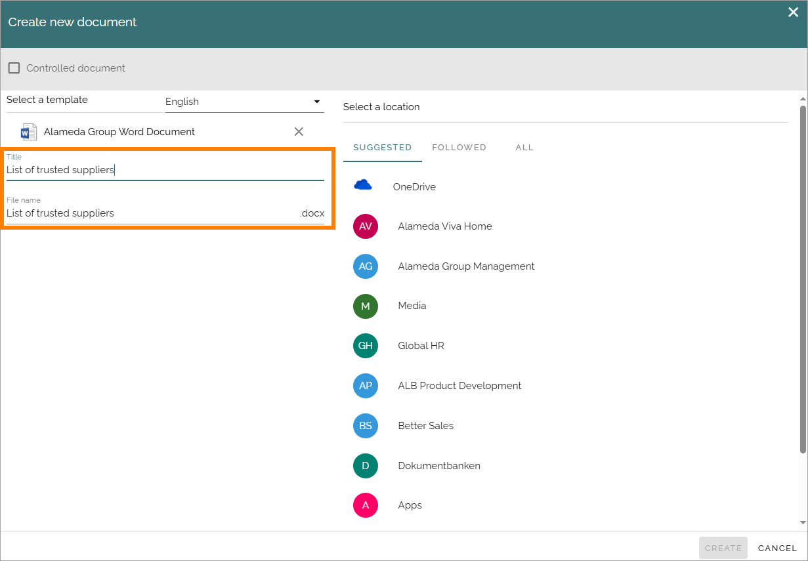

6. Select a location to save the document to.

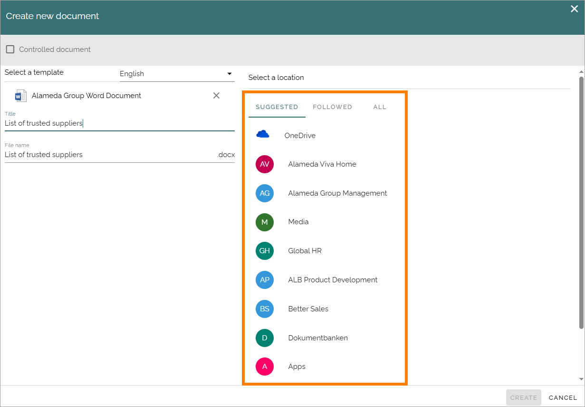

OneDrive is your personal Microsoft 365 OneDrive and should normally be used only for documents you don't need to share. If "Intranet" is selected - if available - a list of folders you have access to in the intranet is shown. The rest of the locations are normally available teamsites. If you select ALL you can search for a document libary.

**Note!** For the OneDrive option to be available, the tenant feature "Save to OneDrive" must be active. 

7. Select folder in that location.

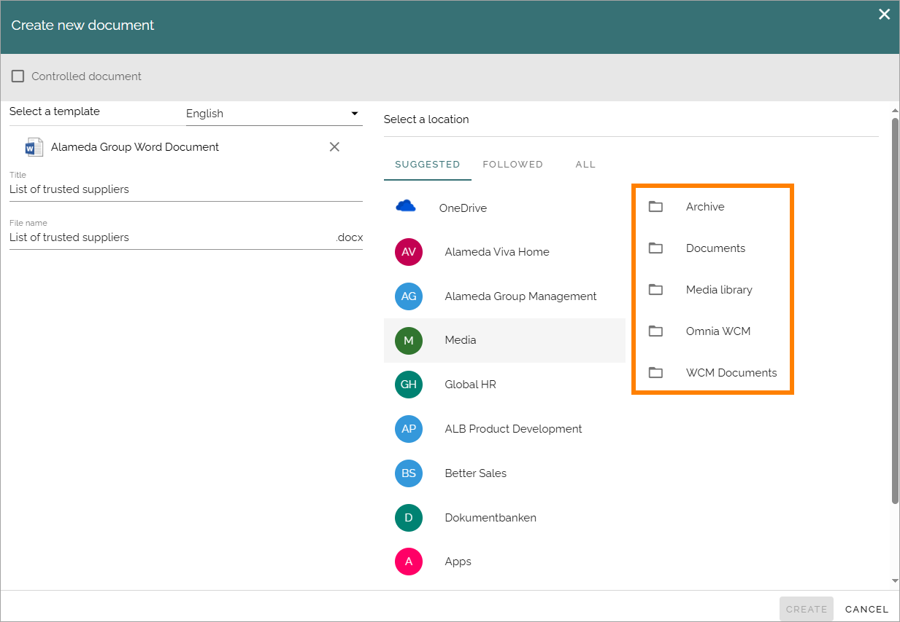

It can be possible to select or create a new folder in some document libraries, if necessary. That is normally true, for example, for document libraries in teamsites where you are a member.

When you point at a libray or folder, an arrow is displayed:

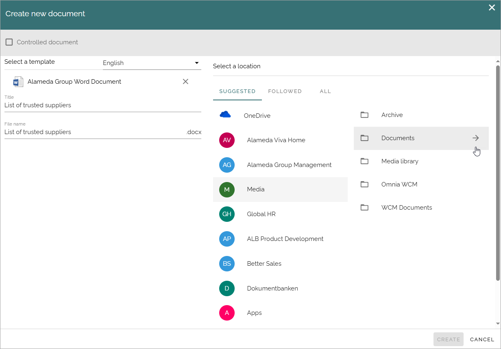

Click the arrow and folders are shown, if any exist. You can select a folder to save the document in. 

8. Create a subfolder if needed.

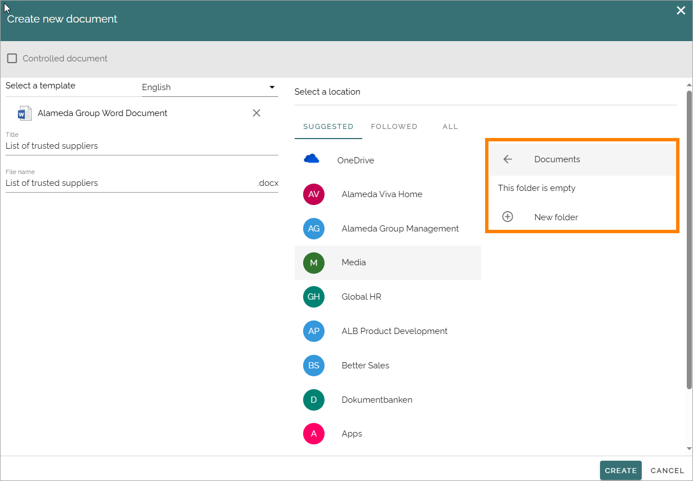

Note that the option to create a new folder, always is available at the bottom of the folder list. So if it's a long list of folders you may have to scroll down to find it.

When you have selected library, and folder if necessary:

8. Click CREATE.

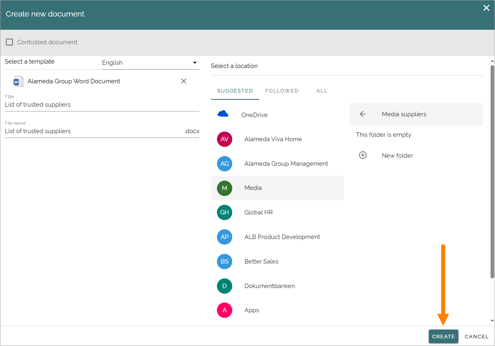

The document is normally opened so you can start working on it. 

